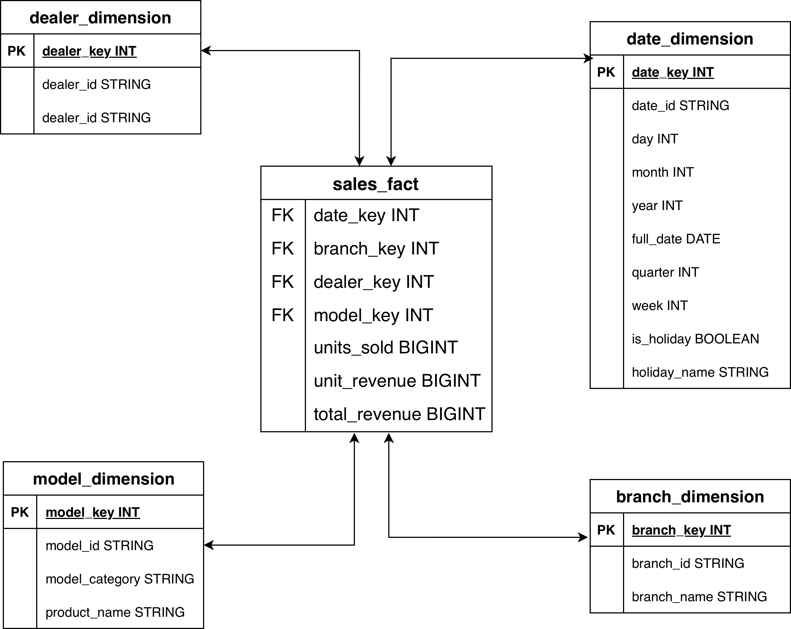

# Azure End-to-End Lakehouse — Car Sales

An end-to-end data engineering project that ingests raw car sales data, processes it through a medallion (bronze → silver → gold) lakehouse on Azure Databricks, and models it into a star schema ready for analytics and reporting.

## Overview

This project takes a car sales dataset from a flat CSV source and moves it through a full Azure lakehouse pipeline: ingestion with Azure Data Factory, layered processing and governance with Azure Databricks and Unity Catalog, and a dimensional (star schema) model in the gold layer that serves business intelligence tools. The supporting Azure infrastructure is provisioned with Terraform, and the Databricks processing is orchestrated as a scheduled job.

## Architecture


The pipeline follows these stages:

1. **Source** — Car sales data (CSV), stored in this repository under `data-source/`.
2. **Ingestion (Azure Data Factory)** — The data is loaded incrementally using a **watermark-based pattern**: a watermark table records the last-loaded point, and a stored procedure advances it on each run so that only new records are pulled. The ingested data lands in an external location (the **landing zone** container) on Azure Data Lake Storage Gen2.
3. **Processing (Azure Databricks + Unity Catalog)** — All transformation runs in Databricks, governed by Unity Catalog, across three medallion layers:
   - **Bronze** — A faithful, raw copy of the landing-zone data, persisted as-is for replayability.
   - **Silver** — Cleaned and conformed data: type fixes, renaming, derived measures, and a single consolidated table.
   - **Gold** — The business-ready **star schema** (one fact table and four dimension tables).
4. **Orchestration** — A Databricks job runs the silver and gold notebooks in sequence; its definition is version-controlled in this repository.
5. **Reporting** — The gold star schema serves BI tools. *A Power BI connection is planned and will be added in a future update.*

## Data Model (Star Schema)



The gold layer is modeled as a star schema with a central `sales_fact` table referencing four dimensions via surrogate keys:
Each dimension uses a surrogate key (`*_key`) as its primary key while retaining the original business ID, and the fact table includes unknown-member handling (key `-1`) so that any unmatched records are captured rather than silently dropped.

## Tech Stack

- **Azure Data Factory** — incremental ingestion (watermark pattern)
- **Azure Data Lake Storage Gen2** — landing zone and managed storage
- **Azure Databricks** — transformation across bronze, silver, gold
- **Unity Catalog** — data governance and the `catalog.schema.table` namespace
- **Delta Lake** — table format for the lakehouse layers
- **Terraform** — infrastructure as code for the Azure resources
- **Power BI** *(planned)* — reporting and dashboards

## Repository Structure

```
azure-e2e-lakehouse/
├── data-source/      # Raw car sales dataset (CSV)
├── data-factory/     # Azure Data Factory pipeline definitions
├── databricks/       # Databricks notebooks and the job definition
├── iac/              # Terraform infrastructure-as-code
├── sql/              # SQL used in the ingestion process
│   ├── table.sql       # Source/staging table definition
│   ├── watermark.sql   # Watermark table for incremental loads
│   └── procedure.sql   # Stored procedure to advance the watermark
└── README.md
```

## Pipeline Flow

1. Provision the Azure resources with the Terraform configuration in `iac/`.
2. Run the Azure Data Factory pipeline to incrementally load source data into the landing-zone container.
3. Execute the Databricks job, which processes the data through bronze → silver → gold.
4. Consume the gold-layer star schema from a BI tool.

## Status

The ingestion, lakehouse processing, star-schema modeling, infrastructure, and orchestration are complete. The Power BI reporting layer is in progress and will be documented here once finished.
